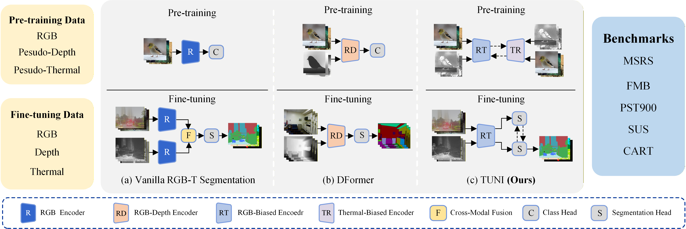
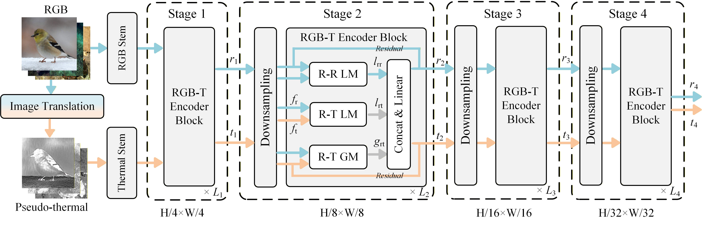
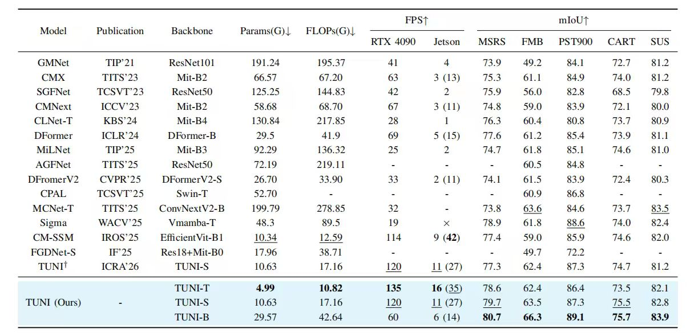
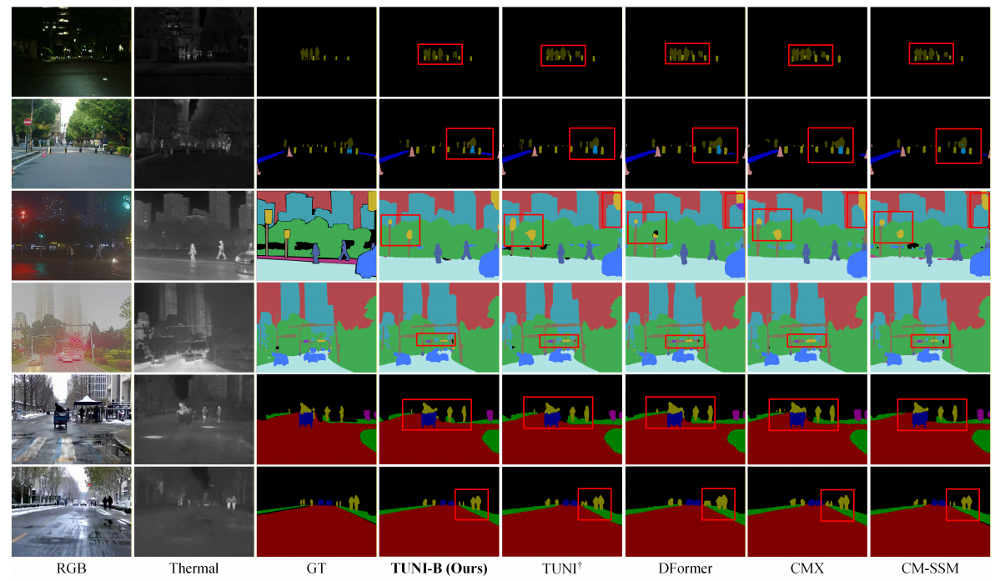

# TUNI (Journal Version)
TUNI: Unifying Pre-training and Fine-tuning with Modality-Aware Mutual Learning and Rectification for RGB-T Semantic Segmentation
## Brief Introduction
This repository serves as an extension to the paper "TUNI: Real-time RGB-T Semantic Segmentation with Unified Multi-Modal Feature Extraction and Cross-Modal Feature Fusion", which has been accpeted by ICRA 2026. We include a summary of the following differences between the journal submission and the conference version:
1. We propose a novel multi-modal pre-training strategy, named **M**odal-**I**nverted **C**ontrastive **M**utual **L**earning (MI-CML).
2. We propose a novel **M**odality **R**ectification **L**earning (MRL) decoder to fully exploit thermal information during the fine-tuning phase.
3. A further trade-off between accuracy and model lightweightness is explored by introducing two encoder variants, TUNI-T and TUNI-B, which respectively target lightweight deployment and high-performance requirements.
4. We have expanded our experiments by including 6 SOTA models: SGFNet , MCNet-T, Sigma, CM-SSM, FGDNet-S, and TUNI. In addition, we conduct additional experiments on two public datasets, MSRS and SUS, to further verify the generalization capability of our model.

We have submitted this paper to IEEE TCSVT. To facilitate the review process, we release the evaluation code, experimental results, and pre-trained model weights in this repository.

<p align="center">
     <br />
    <em> 
    Figure 1: Three RGB-T/RGB-D semantic segmentation frameworks: (a) Vanilla RGB-T segmentation framework. It pre-trains an RGB encoder on ImageNet-1K, and fine-tunes it with the cross-modal feature fusion module and segmentation head on segmentation datasets. (b) DFormer. It pre-trains an RGB-D encoder with RGB and pseudo-depth images from ImageNet-1K, therefore performs multi-modal feature extraction and cross-modal feature fusion simultaneously. (c) TUNI. It first pre-trains an delicate RGB-T encoder with RGB and pseudo-thermal images from ImageNet-1K, incorporating with modality-aware mutual learning to alleviate modality-bias. The modality rectification learning is then introduced during the fine-tuning phase to make full use of the thermal information.
    </em>
</p>

<p align="center">
     <br />
    <em> 
    Figure 2: Illustration of the TUNI encoder. The TUNI encoder consists of multiple stacked RGB-T encoder blocks, each of which includes R-R LM, R-T LM,
and R-T GM. It performs multi-modal feature extraction and cross-modal feature fusion simultaneously, achieving modality-specific feature extraction while
improving fusion efficiency.
    </em>
</p>


## 1. 🌟  NEWS
- [2026/01/31] The conference version of TUNI has been accpected by ICRA 2026 ([paper](https://arxiv.org/abs/2509.10005), [code](https://github.com/xiaodonguo/TUNI))
- [2026/02/07] The journal version of TUNI has submitted to IEEE TCSVT.
- [2026/02/08] We release the evaluation code, experimental results, and pre-trained model weights for journal version.
- [In Future] The training code will be released when our paper is accepted.

## 2. 🚀 Get Start
**0. Install**

```bash
conda create -n TUNI python=3.9 -y
conda activate TUNI

# CUDA 11.8
conda install pytorch==2.0.1 torchvision==0.15.2 torchaudio==2.0.2 pytorch-cuda=11.8 -c pytorch -c nvidia

pip install mmcv tqdm matplotlib scikit-learn opencv-python numpy==1.24.3
```

**1. Download Datasets**  
Download the dataset [MSRS](https://github.com/Linfeng-Tang/MSRS) | [FMB](https://github.com/JinyuanLiu-CV/SegMiF) | [PST900](https://github.com/ShreyasSkandanS/pst900_thermal_rgb) | [CART](https://github.com/aerorobotics/caltech-aerial-rgbt-dataset) | [SUS](https://github.com/xiaodonguo/SUS_dataset).


**2. Download Checkpoints**  
Download pre-train and fine-tune model checkpoints from [here](https://pan.baidu.com/s/1yMqykExCmHpSY1L8vvBIAA), code: 0808.
|Encoder| MSRS | FMB | PST900 | CART | SUS |
|------|-------|-----|--------|------|-----|
|TUNI-T| 78.6      | 62.4 |86.4 |73.5 |82.1|
|TUNI-S| 79.7     | 63.5    |87.3| 75.5| 82.8|
|TUNI-B| 80.7      | 66.3   |89.1| 75.7| 83.9|

**3. evaluation**

```bash
python evaluate.py
```
## 3. 🚩 Performance

<p align="center">
     <br />
    <em> 
    Table 1: Complexity and performance comparison with SOTA methods on MSRS, FMB, PST900, CART and SUS. The Params, FLOPS, and FPS is tested with the image resolution of 640 × 480.
    </em>
</p>

<p align="center">
     <br />
    <em> 
    Figure 3: Visual comparison of segmentation maps produced by TUNI-B, DFormer, TUNI (ICRA), CMX, and CM-SSM on MSRS (top two rows), FMB (middle two rows), and SUS (bottom two rows).
    </em>
</p>

## 4. 🌹 Acknowledgment

Our code is heavily based on [sRGB-TIR](https://github.com/RPM-Robotics-Lab/sRGB-TIR/tree/main) and [DFormer](https://github.com/VCIP-RGBD/DFormer/tree/main), thanks for their excellent work!
