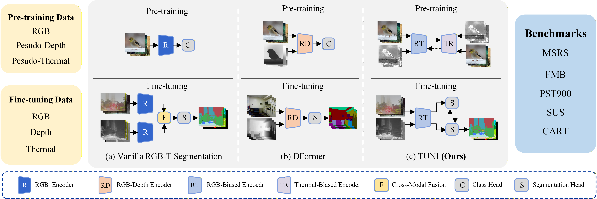
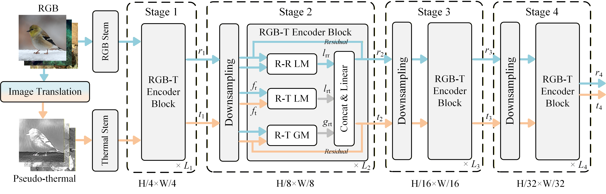
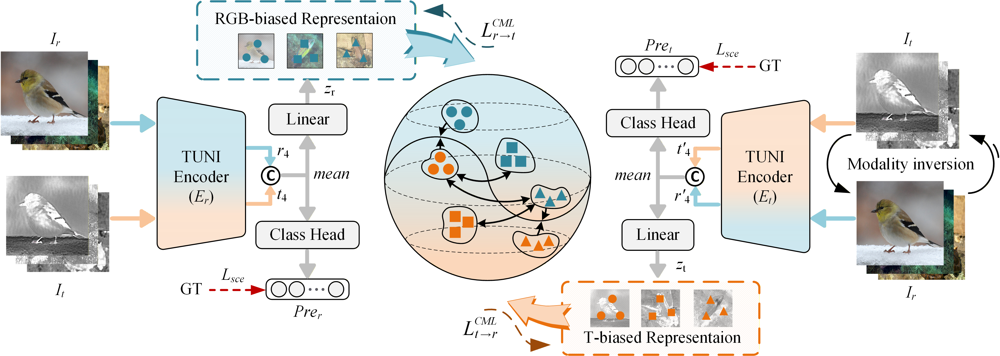
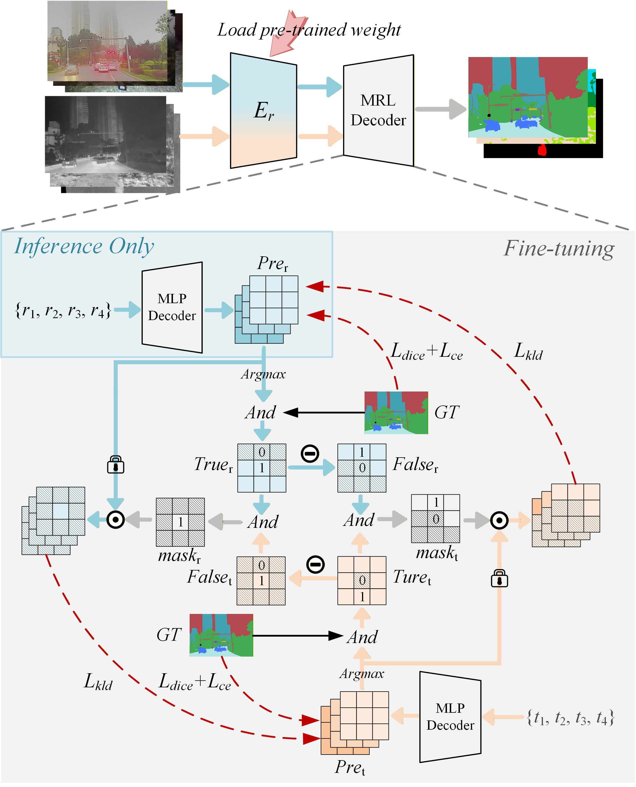
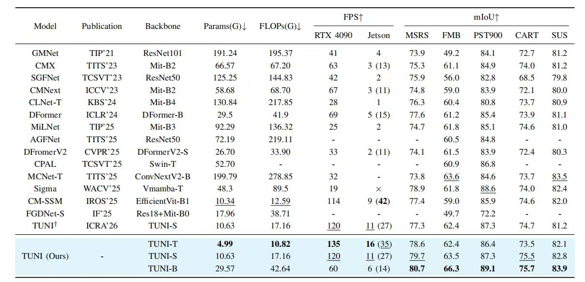
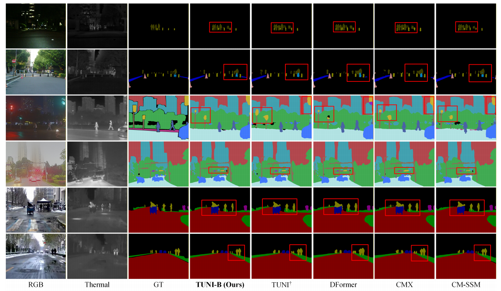

# TUNI-v2
<p align="left">
  <a href='https://arxiv.org/abs/2509.10005'>
  </a> 

</p>
This is the official repository for "TUNI: Unifying Pre-training and Fine-tuning with Modality-Aware Mutual Learning and Rectification for RGB-T Semantic Segmentation".  

## Brief Introduction

<p align="center">
     <br />
    <em> 
    Figure 1: Three RGB-T/RGB-D semantic segmentation frameworks: (a) Vanilla RGB-T segmentation framework. (b) DFormer. (c) TUNI.
    </em>
</p>

Contribution:
1. We propose an RGB-T encoder, named the **TUNI encoder**, for simultaneous multimodal feature extraction and cross-modal feature fusion.
1. We propose a novel multi-modal pre-training strategy, named **M**odal-**I**nverted **C**ontrastive **M**utual **L**earning (MI-CML).
2. We propose a novel **M**odality **R**ectification **L**earning (MRL) decoder to fully exploit thermal information during the fine-tuning phase.

<p align="center">
     <br />
    <em> 
    Figure 2: Illustration of the TUNI encoder.
    </em>
</p>

<p align="center">
     <br />
    <em> 
    Figure 3: Illustration of the MI-CML.
    </em>
</p>

<p align="center">
     <br />
    <em> 
    Figure 4: Illustration of the MRL.
    </em>
</p>


## 1. 🌟  NEWS
- [2026/06/20] Fine-tuning code is released (The pre-training code is being organize).
- [2026/06/01] TUNI-v2 is accepted by IEEE TCSVT.
- [2026/02/07] TUNI-v2 is submitted to IEEE TCSVT.
- [2026/01/31] TUNI is accpected by ICRA 2026 ([paper](https://arxiv.org/abs/2509.10005), [code](https://github.com/xiaodonguo/TUNI))

## 2. 🚀 Get Start
### Pre-training

Please refer to [RGBT-Pretrain](https://github.com/xiaodonguo/RGBT-Pretrain) for the pre-training details.

### Finte-tuning
**0. Install**

```bash
git colone https://github.com/xiaodonguo/TUNI-v2.git
cd TUNI-v2.git
conda create -n TUNI python=3.9 -y
conda activate TUNI
# CUDA 11.8
conda install pytorch==2.0.1 torchvision==0.15.2 torchaudio==2.0.2 pytorch-cuda=11.8 -c pytorch -c nvidia
pip install mmcv tqdm matplotlib scikit-learn opencv-python numpy==1.24.3
```

**1. Download Datasets**  
Download the [dataset](https://pan.baidu.com/s/16PDNN6MYW5Z9mFDfqKbZQA) following our organization, code: 0909.


**2. Download Checkpoints**  
Download pre-train and fine-tune model checkpoints from [here](https://pan.baidu.com/s/1yMqykExCmHpSY1L8vvBIAA), code: 0808.
|Encoder| MSRS | FMB | PST900 | CART | SUS |
|------|-------|-----|--------|------|-----|
|TUNI-T| 78.6      | 62.4 |86.4 |73.5 |82.1|
|TUNI-S| 79.7     | 63.5    |87.3| 75.5| 82.8|
|TUNI-B| 80.7      | 66.3   |89.1| 75.7| 83.9|

**3. Train**
1) dowanload the pretrained weights of TUNI encoder and change the path in proposed/model.py
```bash
python train.py --config configs/MSRS.json
```
**4. Evaluation**

```bash
python evaluate.py --config configs/MSRS.json --load_pth your_weights_path
```
## 3. 🚩 Performance

<p align="center">
     <br />
    <em> 
    Table 1: Complexity and performance comparison with SOTA methods on MSRS, FMB, PST900, CART and SUS. The Params, FLOPS, and FPS is tested with the image resolution of 640 × 480.
    </em>
</p>

<p align="center">
     <br />
    <em> 
    Figure 3: Visual comparison of segmentation maps produced by TUNI-B, DFormer, TUNI (ICRA), CMX, and CM-SSM on MSRS (top two rows), FMB (middle two rows), and SUS (bottom two rows).
    </em>
</p>

<p align="center">
    <video 
        src="https://github.com/user-attachments/assets/7d54a10d-8bfd-428b-b1f6-1bb66edcf45b" 
        >
    </video>
    <br />
    <em>
    A video demo that visually shows the performance improvements over the baseline and ablation baselines.
    </em>
</p>

## 4. 🌹 Acknowledgment

Our code is heavily based on [sRGB-TIR](https://github.com/RPM-Robotics-Lab/sRGB-TIR/tree/main) and [DFormer](https://github.com/VCIP-RGBD/DFormer/tree/main), thanks for their excellent work!

## 5. ✉️ Contact

Email: guoxd@bit.edu.cn  
Wechat: xiaodonglalaa

## 6. ⭐ Citation

If you find this repository useful in your research, please consider giving a star ⭐ and a citation.
```
@ARTICLE{TUNIv2,
  author={Guo, Xiaodong and Guo, Xianda and Liu, Tong and Deng, Zhihong and Peng, Yanlun and Li, Xiang and Zhou, Wujie},
  journal={IEEE Transactions on Circuits and Systems for Video Technology}, 
  title={TUNI: Unifying Pre-training and Fine-tuning with Modality-Aware Mutual Learning and Rectification for RGB-T Semantic Segmentation}, 
  year={2026},
  doi={10.1109/TCSVT.2026.3701706}
}

@INPROCEEDINGS{TUNI,
  author={Guo, Xiaodong and Liu, Tong and Li, Yike and Lin, Zi'ang and Deng, Zhihong},
  booktitle={2026 IEEE International Conference on Robotics and Automation (ICRA)}, 
  title={TUNI: Real-time RGB-T Semantic Segmentation with Unified Multi-Modal Feature Extraction and Cross-Modal Feature Fusion}, 
  year={2026}
}

```

### 7. License

Code in this repo is for non-commercial use only.
